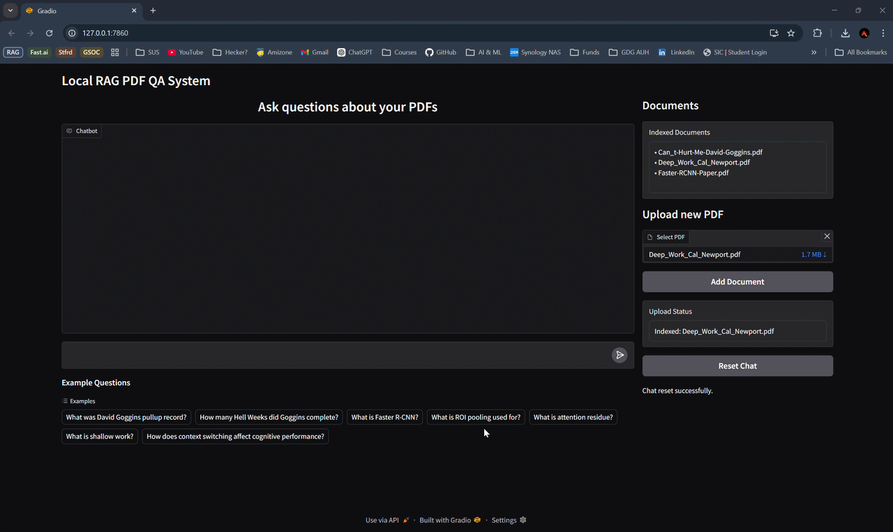

# D-RAGon System

<p align="center">
  
</p>

<p align="center">
Local Retrieval-Augmented Generation (RAG) system for answering questions over PDF documents using semantic retrieval, reranking, and a locally hosted LLM.
</p>


## Overview

The D-RAGon System is a fully local RAG pipeline that enables natural-language querying over private PDF documents. It retrieves relevant document passages using dense embeddings and reranking, then generates grounded answers using a local LLM via Ollama.

This approach improves factual accuracy and reduces hallucinations compared to standalone LLM generation.

The system runs entirely locally, requiring no external API calls.

## Documentation

Full technical documentation, architecture details, and evaluation methodology are available in Notion:

[D-RAGon System Notion](https://www.notion.so/D-RAGon-System-2f4ff95a7099801f87e9f9029e46f7e7)

## Key Features

- Fully local inference (no API dependency)
- Semantic retrieval using BGE embeddings
- Vector storage using ChromaDB
- Cross-encoder reranking for improved retrieval precision
- Local Llama-3.1 inference via Ollama
- Conversational chat support
- Source citation display
- Gradio-based web interface
- Evaluation framework with accuracy and hallucination metrics


## System Architecture

Pipeline:

PDF → Chunking → Embedding → Vector DB → Retrieval → Re-Ranking → Prompt → LLM → Answer → Gradio UI

Retrieval configuration:

- Initial retrieval: Top-10 (cosine similarity)
- Re-ranking: cross-encoder/ms-marco-MiniLM-L-6-v2
- Context sent to LLM: Top-4 chunks


## Evaluation Results

Retrieval performance:

| Recall@K | Score |
|--------|------|
| Recall@4 | 0.83 |
| Recall@6 | 0.87 |
| Recall@8 | 0.90 |
| Recall@10 | 0.97 |

End-to-end performance:

| Mode | Accuracy | Hallucination Rate | Avg Latency |
|------|----------|--------------------|-------------|
| Stateless | 1.00 | 0.13 | 3.78s |
| Conversational | 0.97 | 0.27 | 3.72s |


## Tech Stack

- Python
- LangChain
- ChromaDB
- BAAI/bge-large-en-v1.5 embeddings
- cross-encoder/ms-marco-MiniLM-L-6-v2 reranker
- Llama-3.1-8B-Instruct via Ollama
- Gradio
- RTX 4080 local inference

## Project Structure
```
D-RAGon_System/
│
├── Code/
│ ├── Rag_pdf_QA.ipynb      # Development and experimentation notebook
│ ├── Final_pipeline.ipynb  # Final integrated pipeline notebook
│ ├── Simple_pipeline.py    # Basic stateless RAG pipeline
│ ├── Pipeline_With_hist.py # Conversational RAG pipeline
│ ├── Updated_pipeline.py   # Final production RAG pipeline 
│ └── app.py                # Gradio UI interface 
│
├── Data/
│ ├── Faster-RCNN.pdf
│ ├── Cant-Hurt-Me.pdf
│ └── Deep-Work.pdf
│
├── Eval/
│ └── evaluation dataset and scripts
│
├── requirements.txt        # Python dependencies
├── README.md               # Project documentation
└── .gitignore
```
## How to Run the System

### 1. Clone the repository

```bash
git clone https://github.com/Daddy-Myth/D-RAGon_System.git
cd D-RAGon_System
```


### 2. Create and activate the conda environment

```bash
conda create -n dragon python=3.10
conda activate dragon
```


### 3. Install dependencies

```bash
pip install -r requirements.txt
```


### 4. Start Ollama (LLM inference server)

Run in a separate terminal:

```bash
ollama serve
```

If the model is not installed yet, run once:

```bash
ollama run llama3.1
```


### 5. Launch the Gradio UI

```bash
python Code/app.py
```

### 6. Open the interface

Open your browser and go to:

```bash
http://localhost:7860
```

You can now:

- Upload and index PDF documents
- Ask questions using natural language
- View grounded answers with source citations
- Use conversational chat mode


## Optional: CLI Usage

Ingest PDFs into the vector database:

```bash
python Code/Updated_pipeline.py ingest
```

Ask a single question:

```bash
python Code/Updated_pipeline.py query --q "What was David Goggins max weight?"
```

Start conversational chat mode:

```bash
python Code/Updated_pipeline.py chat
```

Reset chat history:

```bash
python Code/Updated_pipeline.py reset-chat
```

Show database statistics:

```bash
python Code/Updated_pipeline.py info
```
## Dataset

Sample indexed documents include:

- Faster R-CNN research paper
- Can't Hurt Me — David Goggins
- Deep Work — Cal Newport


## Future Work

- Hybrid retrieval (BM25 + dense embeddings)
- Faster inference via caching
- FastAPI deployment
- Docker containerization
- Larger embedding and LLM models
- Cloud deployment


## Author

Archit Yadav

Samsung Innovation Campus Capstone Project